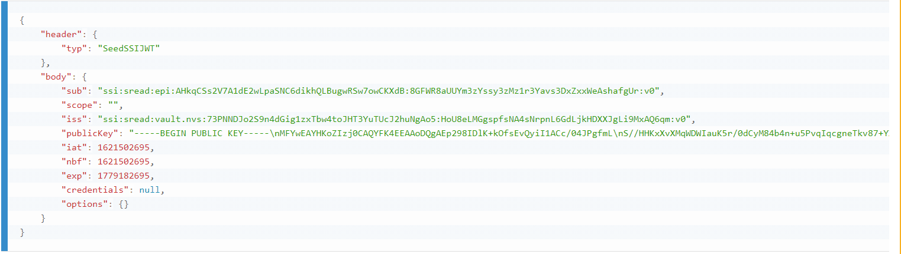

# acdc-workspace

ACDC means Anti-Counterfeiting Data Collaboration - Use-Case 4 of PharmaLedger

*acdc-workspace*  a clone of the ePi https://github.com/PharmaLedger-IMI/epi-workspace modified for ACDC Purposes.


## Installation

In order to use the workspace, we need to follow a list of steps presented below. 


### Step 1: Clone the workspace

```sh
$ git clone https://github.com/PharmaLedger-IMI/acdc-workspace.git
```

After the repository was cloned, you must install all the dependencies.

```sh
$ cd acdc-workspace
#Important: If you plan to contribute to the project and/or dependecies please set DEV:true
#in the file env.json before you run the installation!
$ npm install
```
**Note:** this command might take quite some time depending on your internet connection and you machine processing power.

### Step 2: Launch the "server"

While in the *acdc-workspace* folder run:

```sh
$ npm run server
```

At the end of this command you get something similar to:


### Step 3: Build all things needed for the application to run.

Open a new console inside *acdc-workspace* folder and run:

```sh
# Note: Run this in a new console inside "epi-workspace" folder
$ npm run build-all
```


## Running 
To run the application launch your browser (preferably Chrome) in Incognito mode and access the http://localhost:8080 link.

### Enterprise wallet

Enterprise wallet allows creation of Products and Batches.

#### Step 1: Register details

```
Username: test1234

Email: test@test.test

Company: Test Company Inc

Password: Test1234567890#
```

#### Step 2: Setup credentials for Issuer and Holder
    1. Go to MAH as Issuer page
    2. Put "epi" in application domain field and press "Generate an identifier as company" button
    3. Go to User as Holder page
    4. Enter the application domain "epi" and press "Generate an Identifier as User" button
    5. Copy the generated User Identity
    6. Go again to MAH as Issuer page
    7. Paste the generated User Identity into the first input field
    8. Press the "Generate Credential" button
    9. Copy the generated credential
    10. Go again to User as Holder page
    11. In the "Human readable User Identity" section paste the previous generated crendetial and press the button "Save Credential"
    12. Finally for the current user, the Human readable Credential should look like the following: 
    
   
Now you will act as a Holder thus will be able to add Products (and leaflets for it) and create Batches of products.

#### Add Products to Enterprise Wallet for ACDC Scan Response
    # Product 1
    Product Name: Cosentyx
    Product Code (GTIN/NTIN): 02113100000011
    BatchID: MAY1701
    Expiry Date: 2022-04-30
    Serial Number: {
        valid: 43023992515022
        recalled: 43023992515000
        decommissioned: 43023992515099
    }
    MAH: Novartis

    # Product 2
    Product Name: Keytruda
    Product Code (GTIN/NTIN): 01133111111118
    BatchID: MAY1702
    Expiry Date: 2022-04-30
    Serial Number: {
        valid: 33023992515022
        recalled: 33023992515000
        decommissioned: 33023992515099
    }
    MAH: MSD

    # Product 3
    Product Name: Fluarix
    Product Code (GTIN/NTIN): 01183111111137
    BatchID: MAY1703
    Expiry Date: 2022-04-30
    Serial Number: {
        valid: 33023992515022
        recalled: 33023992515000
        decommissioned: 33023992515099
    }
    MAH: GSK

### EPI Client
This is the part a normal user will see. The part that will
be used to scan barcodes on drug's packages.

## Prepare & release a new stable version of the workspace
Steps:
1. start from a fresh install of the workspace.
```
git clone https://github.com/PharmaLedger-IMI/acdc-workspace
cd acdc-workspace
```
2. ensure that env variable called DEV is set to true in env.json file
>{
>  "PSK_TMP_WORKING_DIR": "tmp",
>  "PSK_CONFIG_LOCATION": "../apihub-root/external-volume/config",
>  **"DEV": true**
>}
3. run the installation process of the workspace
```
npm install
```
4. run the server and build the ssapps and wallets
```
npm run server
npm run build-all
```
4. verify that the builds are successfully and the ssapps are functioning properly
5. execute the freeze command
```
npm run freeze
```
6. verify the output of freeze command and check for errors. If any, correct them and run again the freeze command.
7. commit the new version of the octopus.json file obtained with the freeze command.


### Build Android APK

Steps

1. Install all dependencies (as develoment) for this workspace
```sh
npm run dev-install
```

2. Bind Android repository into workspace
```sh
npm run install-mobile
```

3. Launch API HUB
```sh
npm run server
```

4. Prepare the Node files that will be packed into the Android app
```sh
#In another tab / console
npm build-mobile
```

5. Have /mobile/scan-app/android/local.properties file with the following content

```sh
# Change the value to your SDK path
sdk.dir=/home/alex/Android/Sdk
```
More on this [here](https://github.com/PrivateSky/android-edge-agent#iv-setup-local-environment-values)

6. Build the APK
```sh
npm build-android-apk
```

This concludes the steps to build the APK file.

**Note:** The .apk file should be in folder
```
mobile/scan-app/android/app/build/outputs/apk/release
<<<<<<< HEAD
```

### Build iOS App

1. Install carthage & (Homebrew https://brew.sh/)
```
brew install carthage
```


# Misc

## How to pull latest ePi changes

```sh
git remote add epi https://github.com/PharmaLedger-IMI/epi-workspace
git pull epi master
```

# Contributions

If you think you can contribute, please check with the team, if it is ok to submit a pull-request.

## Follow the "10 commandments" at https://jaxenter.com/10-commandments-committing-pull-requests-115707.html

1. Thou Shalt not reformat
2. Thou shalt absolutely not fix whitespace
3. Thou Shalt not refactor
5. Thou Shalt not rename
6. Thou shalt document
7. Thou shalt not implement more than one thing in a single commit
8. Thou shalt ask the vendor / community first
9. Thou shalt not demand
10. Thou shalt accept the license terms

